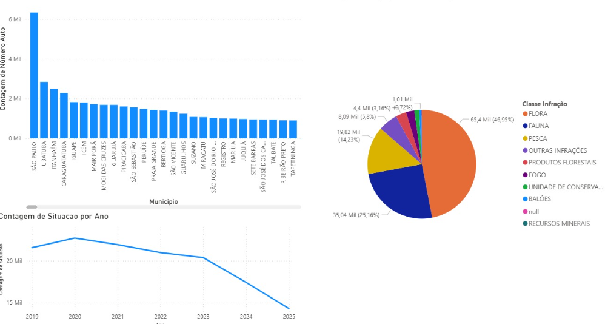
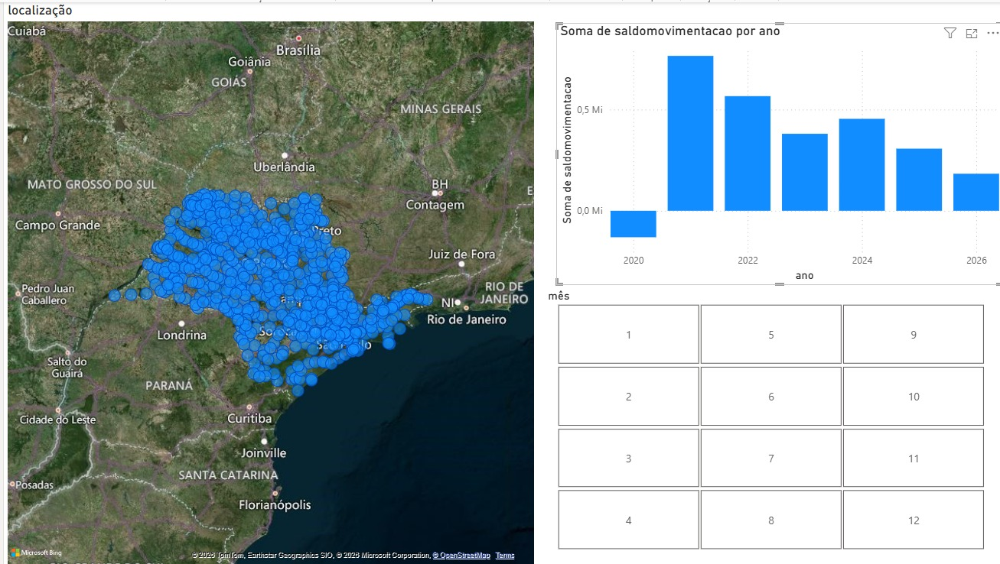
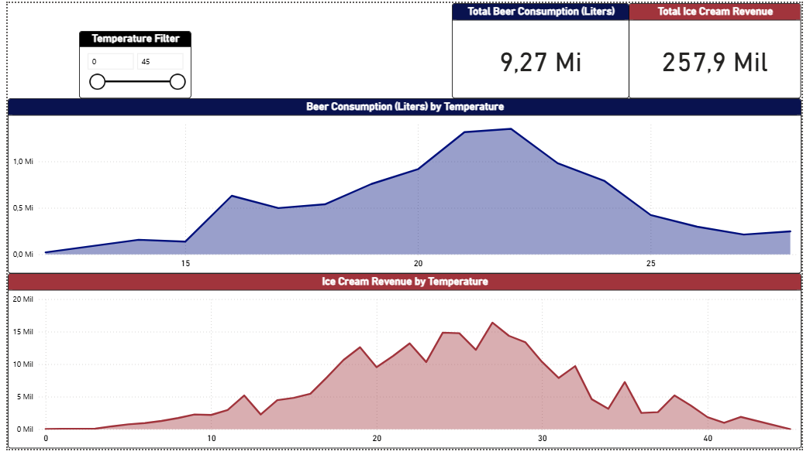

# Aula 08 - Introdução ao Power BI

## Primeira experiência com Power BI utilizando dados abertos do estado de São Paulo (Meio ambiente/autos de infração ambiental)

# Aula 09 - Tratamento de dados Power BI

## Tratamentos de dados abertos do estado de sp

trabalho-emprego-formal-municipios do estado de são Paulo utilizando a função 'CONCATENATE'

# Aula 10 - Elaborando perguntas Power BI

## utilizando o powerbi com os Dados abertos sp para responder perguntas:

### 1 - qual ano e mês o saldo de movimentação foi menor ?

### resposta: o ano foi o 2020 e o mês foi abril.

### 2 - Qual ano e mês teve o maior saldo de admissão?

### resposta: O ano foi 2025 e o mês foi fevereiro.

### 3 - Qual ano e mês teve o menor saldo de admissão?

### resposta: o ano foi 2020 e o mês foi maio

# Aula 11 - Regressão Linear

## Dados kaggles Data setet/Temperatura and ice cream sales editamos no "Excel" para obtermos o Y=0,7083X + 47,843
## E levamos aos google colap utilizando phyton na biblioteca pandas para obtermos a regressão linear e o coeficiente -0,67

# Aula 12 - Regressao Linear 2

## Utilizando o conjunto de dados Redwine quality e fazendo regressão linear para analise da qualidade do vinho

# Aula 13 - Dashboard

## Criação de um dashboard no powerbi com os dados de consumo de cerveja x consumo de sorvete

